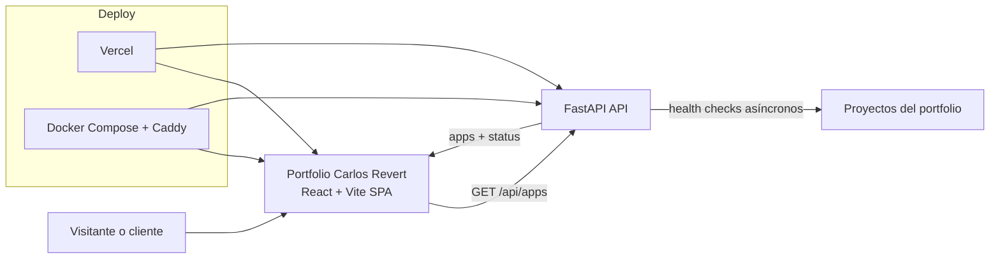

# Portfolio Carlos Revert

[](https://carlosrevert.es)


## Proyectos públicos

Explora las instancias públicas del portfolio de Carlos Revert. Haz clic en cada proyecto para visitarlo:

- [Home](https://carlosrevert.es) — Portal principal y catálogo.
- [CLARK](https://clark.carlosrevert.es) — Catálogo inteligente y venta asistida de maquinaria.
- [Asistente Jurídico](https://juridia.carlosrevert.es) — Sistema RAG jurídico con respuestas trazables a fuentes oficiales.
- [Transcriptor](https://transcriptor.carlosrevert.es/) — Audio, transcripción e informes estructurados con IA.

> Portfolio de Carlos Revert para presentar productos reales de desarrollo Full Stack, IA aplicada, sistemas RAG e infraestructura.

Portfolio Carlos Revert es la web principal de mi marca personal y el punto de entrada a los proyectos que ya están en producción o listos para demostración. Su objetivo no es solo enseñar una marca: explica con claridad qué problemas resuelvo, cómo trabajo y qué tipo de software soy capaz de desplegar en empresas industriales y entornos con alta exigencia de privacidad.


## Inicio rápido y comandos Make

### Puesta en marcha rápida

```bash
cp .env.example .env
bun install
make rebuild
```

Con eso levantas el stack Docker completo con frontend en el puerto `10000` y API en el puerto `10001`.

### Comandos principales

| Comando | Qué hace |
| --- | --- |
| `make up` | Arranca los contenedores existentes en segundo plano. |
| `make down` | Detiene y elimina los contenedores del stack local. |
| `make rebuild` | Reconstruye imágenes y levanta frontend + API desde cero. |
| `make dev` | Lanza el frontend con Vite en el puerto `10002`, útil si Docker ya está ocupando `10000`. |
| `bun run dev` | Ejecuta el frontend en local con Vite en `0.0.0.0:10000`. |
| `bun run build` | Genera el build de producción del frontend. |
| `bun run lint` | Ejecuta ESLint sobre el frontend. |
| `bun run preview` | Sirve el build compilado del frontend en `10000`. |
| `bun run dev:api` | Lanza la API FastAPI en local sobre el puerto `10001`. |

### Puertos del proyecto

| Servicio | Puerto | Uso |
| --- | --- | --- |
| Frontend Vite | `10000` | Desarrollo local principal. |
| Frontend alternativo | `5202` | Desarrollo cuando Docker ya está activo. |
| API FastAPI | `10001` | Catálogo dinámico y health checks. |

## Stack tecnológico

| Capa | Tecnologías | Rol en el proyecto |
| --- | --- | --- |
| Frontend | Bun, React 19, Vite 7, TypeScript 5.9 | SPA rápida, tipada y preparada para despliegue moderno. |
| UI | Tailwind CSS v4, Framer Motion, Lucide React | Interfaz visual, animaciones y sistema de iconografía. |
| Estado y routing | Zustand, React Router | Estado global ligero y navegación de la SPA. |
| Backend | Python 3.12, FastAPI, Pydantic, httpx | API de catálogo, validación de esquemas y comprobación asíncrona de estado. |
| Infraestructura | Docker, Docker Compose, Caddy, Vercel | Ejecución local, reverse proxy y despliegue web/API. |

## Webs y soluciones que presenta el portal

El catálogo presenta soluciones concretas del portfolio de Carlos Revert, cada una con una propuesta de valor distinta y un enlace público directo.
| Solución | Qué muestra | Enfoque principal |
| --- | --- | --- |
| **CLARK** | Plataforma B2B con catálogo, comparador, presupuestos y asistencia contextual. | Next.js, PostgreSQL, pgvector, RAG e IA local. |
| **Asistente Jurídico** | Sistema RAG jurídico con respuestas trazables y referencias al BOE. | Python, PostgreSQL, Qdrant, RAG y Docker. |
| **Transcriptor con IA** | Audio, transcripciones e informes estructurados con procesamiento asíncrono. | FastAPI, React, PostgreSQL, Whisper y LLM. |

Además del catálogo, la landing comunica los pilares de mi perfil: producto Full Stack, IA aplicada, datos, automatización, despliegue cloud o local y escalabilidad.

## Arquitectura del sistema

El proyecto sigue una arquitectura de portal SPA con una API ligera de metadatos. El frontend renderiza la experiencia pública y la API devuelve el catálogo y su estado en tiempo real.
### Patrón general

- **Frontend-first SPA** para la experiencia pública y el catálogo.
- **API desacoplada** para metadatos y health checks de las soluciones publicadas.
- **Doble despliegue**: Vercel para enfoque serverless y Docker Compose para despliegue controlado con Caddy.

### Diagrama de arquitectura



## Estructura del proyecto

```text
.
├── api/                    # API FastAPI para catálogo y health checks
│   ├── index.py            # Modelos, endpoints y comprobación de estado de apps
│   └── requirements.txt    # Dependencias Python mínimas
├── docker/                 # Configuración del servidor web en contenedor
│   └── Caddyfile           # Reverse proxy a la API y serving estático del frontend
├── public/                 # Recursos públicos que no pasan por el bundler
│   └── assets/
├── scripts/                # Scripts auxiliares de despliegue y actualización
│   ├── deploy.sh
│   └── update.sh
├── src/                    # Aplicación frontend
│   ├── components/         # Hero, badges de servicios y cards del catálogo
│   ├── data/               # Catálogo de fallback si la API no responde
│   ├── lib/                # Cliente API y utilidades
│   ├── pages/              # HomePage y composición de secciones
│   ├── store/              # Estado global con Zustand
│   ├── types/              # Tipos del dominio del catálogo
│   ├── App.tsx             # Rutas principales
│   ├── index.css           # Estilos globales de la landing
│   └── main.tsx            # Bootstrap del frontend
├── Dockerfile.api          # Imagen de producción para FastAPI
├── Dockerfile.web          # Build Bun + serving con Caddy
├── docker-compose.yml      # Orquestación local del stack completo
├── Makefile                # Atajos para desarrollo y rebuild
├── vercel.json             # Rewrites de Vercel para `/api`
├── index.html              # Entrada HTML de la SPA
```

## Documentación técnica profunda

### 1. Qué comunica la web

La home está construida como un recorrido narrativo. Empieza con una propuesta de valor muy directa, continúa con una explicación de quién es Carlos Revert, expone servicios y metodología, muestra el stack tecnológico y termina en el catálogo de soluciones reales. No es una web de marketing vacía: cada bloque prepara al visitante para entender por qué existen los proyectos que se enseñan al final.

### 2. Flujo de datos del catálogo

El catálogo no depende ciegamente de un único endpoint.

1. El frontend intenta resolver la API usando `VITE_API_BASE_URL`, el origen actual y, si hace falta, el dominio canónico `https://carlosrevert.es`.
2. La respuesta se valida en cliente antes de usarse, incluidos los enlaces HTTP(S) de cada proyecto.
3. Si todas las peticiones fallan, la web degrada con elegancia a un catálogo local de fallback incluido en el frontend.
4. La API, a su vez, ejecuta comprobaciones asíncronas contra cada web publicada para devolver un estado `online` u `offline` actualizado.

Ese diseño permite que la landing siga siendo útil incluso si el backend no está disponible en un entorno temporal o durante una demo aislada.

### 3. API y modelos principales

| Endpoint | Método | Descripción |
| --- | --- | --- |
| `/api/health` | `GET` | Devuelve un estado simple de salud de la API. |
| `/api/apps` | `GET` | Devuelve el catálogo de soluciones junto con fecha de generación y estado actualizado. |

El modelo principal del backend es `AppSchema`, que normaliza los siguientes campos:

- Identificador y nombre de la solución.
- Descripción corta y descripción completa para la card y el detalle.
- Tecnologías destacadas.
- URL de destino.
- Categoría funcional (`ai`, `blockchain`, `enterprise`).
- Imagen representativa.
- Estado operativo (`online`, `offline`).

### 4. Variables de entorno

Usa `.env.example` como base y ajusta los valores a tu entorno real.

| Variable | Capa | Obligatoria | Descripción |
| --- | --- | --- | --- |
| `VITE_API_BASE_URL` | Frontend | Recomendado | Base URL preferida para resolver `/api` fuera del mismo dominio. |
| `BACKEND_ALLOWED_ORIGINS` | Backend | Sí | Lista de orígenes permitidos por CORS para la API. |

### 5. Estrategia de despliegue

El proyecto está preparado para dos escenarios:

- **Vercel**: el archivo `vercel.json` reescribe `/api/*` hacia `api/index.py`, lo que permite servir frontend y API con una experiencia muy simple.
- **Docker Compose**: `Dockerfile.web` compila la SPA con Bun y la sirve con Caddy; `Dockerfile.api` ejecuta FastAPI sobre Python 3.12; `docker-compose.yml` conecta ambos servicios en red local y expone los puertos públicos.

## Instalación y configuración

### Prerrequisitos

- Bun 1.x
- Python 3.12
- Docker y Docker Compose, si quieres usar el stack containerizado

### Opción A: desarrollo local por procesos

1. Clona el repositorio.

```bash
git clone <repo-url>
cd Home
```

2. Instala dependencias del frontend.

```bash
bun install
```

3. Crea el archivo de entorno.

```bash
cp .env.example .env
```

4. Levanta la API en una terminal.

```bash
cd api
python3 -m venv .venv
source .venv/bin/activate
pip install -r requirements.txt
uvicorn index:app --reload --host 0.0.0.0 --port 10001
```

5. Levanta el frontend en otra terminal.

```bash
bun run dev
```

6. Abre la web en `http://localhost:10000` o en `https://carlosrevert.es` cuando el DNS/proxy esté configurado.

### Opción B: desarrollo con Docker

```bash
cp .env.example .env
make rebuild
```

Después podrás acceder a:

- Frontend: `http://localhost:10000`
- API: `http://localhost:10001/api/health`

### Validación rápida del entorno

```bash
bun run lint
bun run build
curl http://127.0.0.1:10001/api/health
curl http://127.0.0.1:10001/api/apps
```

## Metodología de trabajo en el servidor

La máquina virtual (`192.168.1.130` en la LAN y `100.122.52.65` por Tailscale) aloja los contenedores. `localhost` siempre significa la máquina desde la que abre el navegador, no esta VM.

- En la misma LAN: usa `http://192.168.1.130:10000`.
- Desde fuera de la LAN con Tailscale: usa `http://100.122.52.65:10000`.
- Desde un IDE o túnel SSH: reenvía el puerto `10000` y usa `http://localhost:10000`.
- En producción: publica el dominio mediante un reverse proxy HTTPS en `80/443`; los puertos internos de desarrollo no deben ser la URL pública.

Cada aplicación debe tener su propio repositorio y `docker-compose.yml`, variables en `.env` fuera de Git, healthchecks, logs y una década/rango de puertos reservado. Durante desarrollo se accede por IP/Tailscale; al pasar a producción se añade el dominio, TLS, backups, monitorización y políticas de firewall.

## Contribución y licencia

### Cómo contribuir

Si vas a extender la landing o añadir nuevas soluciones al catálogo, mantén estas reglas básicas:

1. Usa ramas cortas y centradas en un único cambio funcional.
2. Ejecuta `bun run lint` y `bun run build` antes de abrir una PR.
3. Si tocas la API, verifica manualmente `/api/health` y `/api/apps`.
4. Si añades una nueva solución, actualiza tanto la fuente principal del catálogo como su fallback cuando aplique.
5. Mantén el tono visual y narrativo del portal: claridad comercial por fuera y rigor técnico por dentro.

### Estado de testing

En el estado actual del repositorio no hay una suite de tests automatizados versionada. La validación operativa se apoya en build, lint y comprobaciones manuales del flujo de catálogo.

### Licencia

Este repositorio no incluye todavía un archivo `LICENSE`. Antes de su publicación pública definitiva conviene añadir una licencia explícita o, si aplica, una nota de uso propietario.
